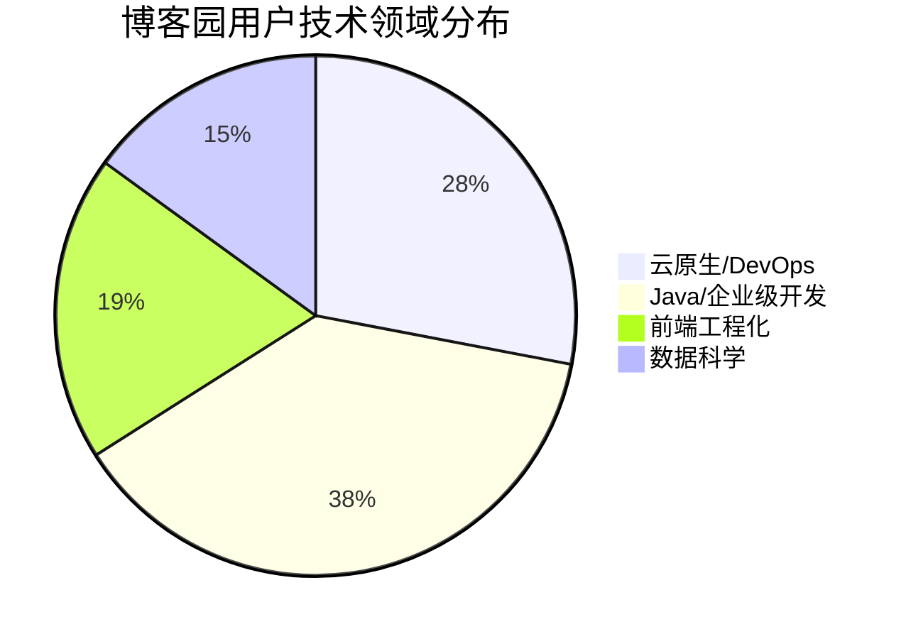

# XBlog

> 演示地址：http://139.155.158.230:17011/home【已不可用】


## 竞品分析（示例）

##### 一、市场背景

- ‌**行业现状**‌：技术博客平台用户规模达1.2亿，开发者内容消费需求年增长18%
- ‌**核心价值**‌：技术沉淀、知识共享、开发者社交网络搭建

##### 二、竞品矩阵（横向对比）

| 维度         | 博客园                 | CSDN              | 掘金              | 简书            | 知乎专栏              |
| ------------ | ---------------------- | ----------------- | ----------------- | --------------- | --------------------- |
| ‌**定位**‌     | 纯技术博客社区         | 综合开发者门户    | 技术+泛科技社区   | 泛文化内容平台  | 问答衍生内容平台      |
| ‌**DAU**‌      | 35万（估算）           | 220万             | 85万              | 120万           | 300万+                |
| ‌**核心功能**‌ | Markdown编辑器 RSS订阅 | 付费专栏 技能图谱 | 沸点社区 学习路径 | 文集系统 IP孵化 | 内容分发算法 盐选会员 |
| ‌**商业化**‌   | 广告+企业版            | 会员体系+培训     | 品牌合作+招聘     | 内容电商        | 知识付费+广告         |
| ‌**技术优势**‌ | 开源生态支持           | 企业服务集成      | 移动端体验        | 推荐算法        | 搜索引擎优化          |

##### 三、深度分析维度

###### 1. 用户画像对比

| 维度                         | 博客园                  | CSDN          | 掘金           |
| ---------------------------- | ----------------------- | ------------- | -------------- |
| ==&zwnj;**日均停留**&zwnj;== | `47min` ███████◖ (TOP1) | `22min` ██◖   | `35min` █████◖ |
| ==&zwnj;**高频行为**&zwnj;== |                         |               |                |
| ▪ 代码收藏                   | 63% ███████▢            | —             | —              |
| ▪ 博客互链                   | 38% ███▢                | —             | —              |
| ▪ 资源下载                   | —                       | 72% ████████▢ | —              |
| ▪ 培训关注                   | —                       | 45% █████▢    | —              |
| ▪ 技术投票                   | —                       | —             | 58% ███████▢   |
| ▪ GitHub同步                 | —                       | —             | 33% ███▢       |
| ==&zwnj;**付费倾向**&zwnj;== |                         |               |                |
| ▪ 企业服务                   | 28% ███▢                | —             | —              |
| ▪ 打赏作者                   | 15% █▢                  | —             | —              |
| ▪ 会员免广告                 | —                       | 65% ███████▢  | —              |
| ▪ 技能认证                   | —                       | 30% ███▢      | —              |
| ▪ 招聘服务                   | —                       | —             | 20% ██▢        |
| ▪ 电子书                     | —                       | —             | 25% ██▢        |


###### 2. 内容生态数据

- ‌**博客园**‌：日均技术文章产出1200篇（Java/Python/前端占比65%）
- ‌**CSDN**‌：付费专栏阅读完成率78%，盗版内容投诉量行业最高
- ‌**掘金**‌：30%内容来自企业官方账号，社区活动参与度达42%

##### 四、SWOT分析

|                        | 优势 Strengths                                            | 劣势 Weaknesses                     |
| ---------------------- | --------------------------------------------------------- | ----------------------------------- |
| ‌**机会 Opportunities**‌ | SO组合： • 抓住云原生技术内容缺口 • 拓展企业级API文档服务 | WO组合： • 开发移动端协同写作工具   |
| ‌**威胁 Threats**‌       | ST组合： • 建立技术护城河应对大厂竞争                     | WT组合： • 广告过多导致用户流失风险 |

## 需求文档（示例）

##### 一、需求池

| 序号 | 提交时间   | 提交人 | 产品模块 | 需求描述                                                     | 优先级 | 需求来源 | 需求类型 | 需求状态 | 处理版本 | 备注                           |
| ---- | ---------- | ------ | -------- | ------------------------------------------------------------ | ------ | -------- | -------- | -------- | -------- | ------------------------------ |
| 1    | 2024-10-12 | SLZ    | 登录     | 1.短信成本太高，改为邮箱验证码登录方式                       | P1     | 开发     | 新增     | 已同意   | 待定     | 需求不是很急，优先处理其它需求 |
| 2    | 2024-10-13 | SLZ    | 评论     | 1.当前评论区位置过于偏下，希望固定在右侧与文章区分，设置滚动条 | P2     | 开发     | 优化     | 待讨论   | 待定     |                                |
| 3    | 2024-10-13 | SLZ    | 首页     | 首页设置轮播图3-5张，用于广告位或引流位置                    | P1     | 开发     | 新增     | 已解决   | 0.0.3    |                                |
| 4    | 2024-10-13 | SLZ    | 首页     | 首页导航栏在线人数显示存在延迟                               | P0     | 开发     | BUG      | 待解决   | 待定     | 优先                           |
| 5    | ……         | ……     | ……       | ……                                                           | ……     | ……       | ……       | ……       | ……       | ……                             |

##### 二、功能清单

| 序号 | 模块     | 子模块   | 功能点   | 功能描述                                                     | 优先级 | 平台 | 备注 |
| ---- | -------- | -------- | -------- | ------------------------------------------------------------ | ------ | ---- | ---- |
| 1    | 社区     | 搜索     | 搜索入口 | 点击输入搜索关键字，返回文章检索列表，支持标题、作者、标签三项的模糊检索 | P2     | Web  |      |
| 2    | 我的博客 | 博客编辑 | 发布博客 | 点击博客发布按钮，吐司提示”博客发布成功“并跳转到博客详情页面，错误提示”博客发布失败“，不要跳转 | P1     | Web  |      |
| 3    |          |          |          |                                                              |        |      |      |
| 4    |          |          |          |                                                              |        |      |      |
| 5    |          |          |          |                                                              |        |      |      |
| 6    |          |          |          |                                                              |        |      |      |
| 7    |          |          |          |                                                              |        |      |      |
| 8    |          |          |          |                                                              |        |      |      |
| 9    |          |          |          |                                                              |        |      |      |
| 10   |          |          |          |                                                              |        |      |      |
| 11   | ...      | ...      | ...      | ...                                                          |        | Web  |      |

## 业务流程图（示例）


## PRD文档（示例）


## 示例图片

### 登录


### 用户端


### 管理端


## 需求分析

* [X]  登录
* [X]  注册
* [X]  Token 生成
* [X]  权限校验
* [X]  忘记密码 / 密码修改
* [X]  密码加密传输
* [X]  开启日志
* [X]  邮箱验证码
* [X]  缓存
* [X]  跨域问题解决
* [X]  路由守卫
* [X]  分页查询
* [X]  博客列表/发布/草稿箱/详情
* [X]  评论功能
* [X]  ~菜单管理~
* [X]  用户/文章 实时排名
* [X]  首页轮播图
* [X]  日期格式类型转换
* [X]  在线人数统计
* [X]  网站浏览量统计
* [X]  文章每天发布数量数据统计(曲线图)
* [X]  登录时长统计
* [X]  标签词云
* [X]  博客多条件检索
* [X]  反馈功能
* [X]  md 文档上传
* [X]  后台管理 \* 包括: 用户**、**~文章、标签、评论、反馈~
* [X]  缓存存放：标签文章数量统计，文章发布数量统计，在线人数统计，浏览量统计，排名统计，文章详情，文章评论列表，统一设置过期时间 5 分钟，
* [X]  日期序列化问题
* [X]  缓存序列化问题

1. **"tagPostsNum::tagPostsNum"**
2. **"userViewRank::userViewRank"**
3. **"postViewRank::postViewRank"**
4. **"visitCount::visitCount"**
5. **"postPublishCount::postPublishCount"**

**6)“postDetail::postId”**

**6)“commentList::postId”**

* [ ]  ~docker 部署~
* [ ]  Supervisior 部署

---

**后端**

* **SpringBoot**
* **Mybatis-Plus**
* **Mybatis-Plus-Generator**
* **FreeMarker**
* **JWT**
* **Mysql**
* **Druid**
* **Swagger3**
* **Lombok**
* **Spring Security  **
* **JavaMailSender**
* **Redis**
* **PageHelper**

**前端：**

* **Vue3**
* **Axios**
* **Html**
* **CSS**
* **JS**
* **Vuex ：状态管理 / 权限控制**
* **Markdown-it**
* **Elentment-plus**

## 问题解决

### 跨域问题解决

1. **WebMvc 配置 WebMvcConfigurer配置类**

```
public class WebMvcConfig implements WebMvcConfigurer {

    // 配置跨域
    @Override
    public void addCorsMappings(CorsRegistry registry) {
        registry.addMapping("/**")
        .allowedOrigins("http://localhost:17011") // 允许的前端地址
        .allowedMethods("GET", "POST", "PUT", "DELETE", "OPTIONS")
        .allowedHeaders("*") // 允许的请求头
        .allowCredentials(true); // 允许携带凭证
    }
}
```

2. **Controller 层添加注解 **`<font style="color:#ED740C;">@CrossOrigin</font>(origins = <font style="color:#74B602;">"http://localhost:17011"</font>)`

```
@RestController
@CrossOrigin(origins = "http://localhost:17011")
@RequestMapping("/xblog/auth")
@Api(tags = "认证管理")
public class AuthController {
}
```

### Token 生成


1. **依赖 **`<font style="color:#DF2A3F;">java-jwt</font>`

```
<!--        jwt -->
<dependency>
  <groupId>com.auth0</groupId>
  <artifactId>java-jwt</artifactId>
  <version>3.18.3</version>
</dependency>
```

2. **编写 JwtTokenUtil 工具类**

```
package com.slz.xblog.utils.token;

import com.auth0.jwt.interfaces.Claim;
import com.slz.xblog.vo.UserInfoVo;
import com.auth0.jwt.JWT;
import com.auth0.jwt.algorithms.Algorithm;
import com.auth0.jwt.interfaces.DecodedJWT;
import com.auth0.jwt.interfaces.JWTVerifier;
import org.springframework.beans.factory.annotation.Value;
import org.springframework.security.authentication.UsernamePasswordAuthenticationToken;
import org.springframework.security.core.Authentication;
import org.springframework.security.core.GrantedAuthority;
import org.springframework.security.core.authority.SimpleGrantedAuthority;
import org.springframework.stereotype.Component;

import javax.servlet.http.Cookie;
import javax.servlet.http.HttpServletRequest;
import java.util.Date;
import java.util.HashMap;
import java.util.List;
import java.util.Map;
import java.util.stream.Collectors;

@Component
public class JwtTokenUtil {
    @Value("${jwt.secretKey}")
    private String SECRET_KEY; // 替换为你自己的密钥
    @Value("${jwt.expiration}")
    private long EXPIRATION_TIME; // 有效时间 / 毫秒
    @Value("${jwt.token.name}")
    private String TOKEN_NAME;

    // 从请求头中获取 token
    public String getTokenFromCookie(HttpServletRequest request) {
        Cookie[] cookies = request.getCookies();
        if (cookies != null) {
            for (Cookie cookie : cookies) {
                if (TOKEN_NAME.equals(cookie.getName())) {
                    return cookie.getValue(); // 返回 token
                }
            }
        }
        return null; // 没有找到 token
    }

    // 生成 token
    public String generateToken(UserInfoVo user) {
        Map<String, Object> claims = new HashMap<>();
        return createToken(claims, user);
    }

    private String createToken(Map<String, Object> claims, UserInfoVo user) {
        Algorithm algorithm = Algorithm.HMAC256(SECRET_KEY);
        return JWT.create()
                .withSubject(user.getUserId())
                .withClaim("userName", user.getUserName())
                .withClaim("email", user.getEmail())
                .withClaim("role", user.getRole())
                .withIssuedAt(new Date())
                .withExpiresAt(new Date(System.currentTimeMillis() + EXPIRATION_TIME))
                .sign(algorithm);
    }

    // 验证 token
    public boolean validateToken(String token, String userId) {
        try {
            JWTVerifier verifier = JWT.require(Algorithm.HMAC256(SECRET_KEY))
                    .withSubject(userId)
                    .build();
            verifier.verify(token);
            return !isTokenExpired(token);
        } catch (Exception e) {
            return false;
        }
    }

    // 从 token 中提取用户 ID
    public String getUserId(String token) {
        return extractAllClaims(token).getSubject();
    }

    // 从 token 中提取角色
    public String getRole(String token) {
        return extractAllClaims(token).getClaim("role").asString();
    }

    // 从 token 中提取用户名
    public String getUserName(String token) {
        return extractAllClaims(token).getClaim("userName").asString();
    }

    // 从 token 中提取邮箱
    public String getEmail(String token) {
        return extractAllClaims(token).getClaim("email").asString();
    }

    // 检查 token 是否过期
    private boolean isTokenExpired(String token) {
        return extractAllClaims(token).getExpiresAt().before(new Date());
    }

    // 获取用户信息
    private UserInfoVo getUserInfo(String token) {
        DecodedJWT jwt = extractAllClaims(token);
        String userId = jwt.getSubject();
        String userName = jwt.getClaim("userName").asString();
        String email = jwt.getClaim("email").asString();
        String role = jwt.getClaim("role").asString();
        return new UserInfoVo(userId, userName, email, role, token);
    }

    // 提取所有声明
    private DecodedJWT extractAllClaims(String token) {
        JWTVerifier verifier = JWT.require(Algorithm.HMAC256(SECRET_KEY)).build();
        return verifier.verify(token);
    }

    // 从 JWT 或其他类型的令牌中解析出用户的身份信息，并返回一个 Authentication 对象
    public Authentication getAuthentication(String token) {
        // 解析令牌并获取用户信息
        DecodedJWT decodedJWT = extractAllClaims(token); // 提取所有声明
        // 获取用户 ID
        Claim userId_claim = decodedJWT.getClaim("userId");
        String userId = userId_claim.asString();
        // 获取角色列表
        Claim roles_claim = decodedJWT.getClaims().get("roles");
        List<String> roles = roles_claim.asList(String.class);
        List<SimpleGrantedAuthority> authorities = roles.stream().map(SimpleGrantedAuthority::new).collect(Collectors.toList());
        // 创建 Authentication 对象
        return new UsernamePasswordAuthenticationToken(userId, null, authorities);
    }
}
```

```
public class GeneratorSecretKey {
    public static void main(String[] args) {
        SecureRandom secureRandom = new SecureRandom();
        byte[] key = new byte[32]; // 256 bits
        secureRandom.nextBytes(key);
        String secretKey = Base64.getEncoder().encodeToString(key);
        System.out.println("Generated SECRET_KEY: " + secretKey);
    }
}
```

### SpringSecurity 作权限校验


1. **依赖**

```
<!--   spring-security     -->
<dependency>
  <groupId>org.springframework.boot</groupId>
  <artifactId>spring-boot-starter-security</artifactId>
</dependency>
```

2. **Security 配置类 SecurityConfig （****注意同样要配置跨域** ）

```
@Configuration
@EnableWebSecurity
public class SecurityConfig extends WebSecurityConfigurerAdapter {
    @Resource
    private JwtAuthenticationFilter jwtAuthenticationFilter;
    @Override
    protected void configure(HttpSecurity http) throws Exception {
        http
                .csrf().disable() // 根据需要选择是否禁用 CSRF 跨站请求伪造
                .authorizeRequests() // 配置请求授权规则
                .antMatchers("/swagger-ui/**").permitAll() // 允许访问 Swagger UI
                .antMatchers("/xblog/public/**","/v3/api-docs/**", "/swagger-resources/**").permitAll() // 允许访问登录接口
                .antMatchers("/xblog/admin/**").hasRole("admin") // 允许访问管理员接口
                .antMatchers("/xblog/user/**").hasAnyRole("user", "admin") // 允许访问用户接口
                .anyRequest().authenticated() // 其他请求需要认证
                .and()
                .httpBasic() // 使用 HTTP Basic 认证
                .and()
                .addFilterBefore(new JwtAuthenticationFilter(), UsernamePasswordAuthenticationFilter.class) // 添加自定义的 JWT 认证过滤器
                .cors() // 启用跨域资源共享
        ;
    }
```

3. **自定义 JWT 认证过滤器，每次请求验证**

```
@Configuration
public class JwtAuthenticationFilter extends OncePerRequestFilter {
    @Resource
    private JwtTokenUtil jwtTokenUtil;
    @Override
    protected void doFilterInternal(HttpServletRequest request, HttpServletResponse response, FilterChain filterChain)
    throws ServletException, IOException {
        // 从请求中提取 JWT 并验证
        String token = request.getHeader("Authorization");
        if (token != null && jwtTokenUtil.validateToken(token, jwtTokenUtil.getUserId(token))) {
            // 解析并设置用户上下文
            Authentication authentication = jwtTokenUtil.getAuthentication(token);
            // 将用户的认证状态保持在当前的请求上下文中，使得在整个请求周期内，应用能够知道当前用户的身份和权限
            SecurityContextHolder.getContext().setAuthentication(authentication);
        }
        filterChain.doFilter(request, response);
    }
}
```

* **公共接口 all**
* **用户接口 user**
* **管理接口 admin **

#### 密码加密


* **数据库存储加密**
* **前后端传输加密**

**采用MD5加密 + 加盐 （邮箱名 + 当日日期）**

1. **前端加密**

```
import md5 from 'crypto-js/md5';

async handleLogin() {
  this.errorMessage = ''; // 清空错误信息
  try {
    const hashedPassword = hashPassword(this.password, this.email) // 将密码加密
    const response = await axios.post('http://localhost:17010/xblog/user/login', {
      email: this.email,
      password: hashedPassword // 发送加密后的密码
    });

    if (response.data.success) {
      const userData = response.data.data.data;
      this.login(userData); // 更新 Vuex 状态
      this.$router.push('/home'); // 跳转到首页或其他页面
    } else {
      this.errorMessage = response.data.msg; // 设置错误信息
      console.error(response.data.msg);
    }
  } catch (error) {
    this.errorMessage = '请求失败，请稍后重试。'; // 设置请求失败的错误信息
    console.error('请求失败:', error);
  }
};
function hashPassword(password, email) {
  // 使用邮箱名字和日期作为盐
  const salt = email;
  // 组合密码和盐，然后进行 MD5 加密
  return md5(password + salt).toString();
}
```

2. **后端加密（数据库加密存储密码）**

```
public class MD5Util {

    // 使用 MD5 加盐加密
    public static String md5WithSalt(String password, String email) {
        String salt = email; // 使用整个邮箱作为盐
        String saltedPassword = password + salt; // 组合密码和盐
        return md5(saltedPassword);
    }

    // MD5 加密
    public static String md5(String input) {
        try {
            MessageDigest md = MessageDigest.getInstance("MD5");
            byte[] messageDigest = md.digest(input.getBytes());
            StringBuilder hexString = new StringBuilder();
            for (byte b : messageDigest) {
                String hex = Integer.toHexString(0xff & b);
                if (hex.length() == 1) hexString.append('0');
                hexString.append(hex);
            }
            return hexString.toString();
        } catch (NoSuchAlgorithmException e) {
            throw new RuntimeException(e);
        }
    }
}
```

### 邮箱验证码


** 在 Spring Boot 中发送邮箱验证码通常可以使用 JavaMailSender。**

1. **依赖**

```
<!-- JavaMailSender 邮件发送-->
<dependency>
  <groupId>org.springframework.boot</groupId>
  <artifactId>spring-boot-starter-mail</artifactId>
</dependency>
```

2. **Spring application.yml 配置邮箱**

```
spring:
  mail:
    host: smtp.qq.com
    username: xxxx@qq.com
    password: your_authorization_code # 是授权码，不是密码
    properties:
      mail:
        smtp:
          auth: true # 这表示启用 SMTP 认证，即在发送邮件时需要使用用户名和密码进行身份验证。
          starttls:
            enable: true # 这表示启用 TLS（传输层安全性
```

3. **Service 层实现逻辑**

```
@Override
public boolean sendVerificationCode(UserInfoVo userInfoVo) {
String email = userInfoVo.getEmail();
if (email==null) return false;
String verificationCode = generateVerificationCode();
String subject = "XBlog 邮箱验证码";
String body = "您的验证码是: " + verificationCode;

SimpleMailMessage message = new SimpleMailMessage();
message.setTo(email);
message.setSubject(subject);
message.setText(body);
message.setFrom(senderEmail); // 替换为你的发件邮箱

mailSender.send(message);
System.out.println("验证码已发送到 " + email);

// 验证码存入缓存，并设置过期时间
// TODO
return true; // 可以返回验证码以便后续验证
}
```

### Redis 缓存


1. **依赖**

```
<!--        redis -->
<dependency>
  <groupId>org.springframework.boot</groupId>
  <artifactId>spring-boot-starter-data-redis</artifactId>
</dependency>
<dependency>
  <groupId>redis.clients</groupId>
  <artifactId>jedis</artifactId>
</dependency>
```

2. **开启redis，配置远程连接操作（略）**
3. **Spring application.yml 配置 redis**

```
spring:
  redis:
    host: 172.25.2.112
    port: 6379
```

4. **主启动类添加 **`<font style="color:#DF2A3F;">@EnableCaching</font>` 注解

```
@SpringBootApplication
@EnableOpenApi
@MapperScan(basePackages = "com.slz.xblog.mapper")
@EnableCaching
public class Application {
    public static void main(String[] args) {
        SpringApplication.run(Application.class, args);
    }
}
```

5. **在需要使用缓存的方法上使用 **`@Cacheable`, `@CachePut`, 或 `@CacheEvict` 注解

* `@Cacheable` 缓存存在，直接取缓存，否则放入缓存
* `@CachePut` 每次都更新缓存
* `@CacheEvict` 清除缓存

6. **或者直接编写 reids缓存工具**

```
@Component
public class RedisCacheUtil {

    @Resource
    private RedisTemplate<String, Object> redisTemplate;

    // 保存数据
    public void set(String key, Object value, long timeout) {
        redisTemplate.opsForValue().set(key, value, timeout, TimeUnit.SECONDS);
    }

    // 获取数据
    public Object get(String key) {
        return redisTemplate.opsForValue().get(key);
    }

    // 删除数据
    public void delete(String key) {
        redisTemplate.delete(key);
    }

    // 判断是否存在
    public boolean exists(String key) {
        return redisTemplate.hasKey(key);
    }

    // 设置过期时间
    public void expire(String key, long timeout) {
        redisTemplate.expire(key, timeout, TimeUnit.SECONDS);
    }

    // 存入并设置过期时间
    public void setWithExpire(String key, Object value, long timeout) {
        redisTemplate.opsForValue().set(key, value, timeout, TimeUnit.SECONDS);
    }
}
```

7. **添加 RedisConfig 配置类防止乱码**

```
@Configuration
public class RedisConfig {
    @Bean
    public RedisTemplate<String, Object> redisTemplate(RedisConnectionFactory redisConnectionFactory) {
        RedisTemplate<String, Object> redisTemplate = new RedisTemplate<>();
        redisTemplate.setConnectionFactory(redisConnectionFactory);
        //key val 采用不同的序列化方式
        // key序列化
        redisTemplate.setKeySerializer(new StringRedisSerializer());
        // value序列化
        redisTemplate.setValueSerializer(new Jackson2JsonRedisSerializer<Object>(Object.class));
        return redisTemplate;
    }
}
```

### 路由守卫


**VUEX 配置路由守卫，控制前端页面访问逻辑**

**Coookie: 有大小限制**

**userData、token 存在 LocalSession，每次请求带上 token，后端每次返回新的 token(更新了过期时间)**

**Vuex 中的数据每次刷新就清空了**

### json 空值不传递


```
spring:
  jackson:
    default-property-inclusion: non_null # json 不显示空值
```

### 使用事务


在使用MyBatis Plus时，默认情况下每个数据库操作都是在一个独立的事务中执行的，也就是说，每个CRUD操作都会立即被提交。如果你需要在多个操作之间开启一个事务，确保这些操作作为一个整体成功或失败，就需要显式地开启和管理事务。

在Spring框架中，通常有两种方式来管理事务：

1. **使用**`**<font style="color:rgb(44, 44, 54);">@Transactional</font>**`**注解**：这是最常见的方式，适合于简单的事务管理。
2. **使用编程式事务管理**：适合于更复杂的事务管理场景。

#### 使用\`@Transactional\`注解


使用`<font style="color:rgb(44, 44, 54);">@Transactional</font>`注解是最简单的方式，只需要在需要管理事务的方法或类上加上这个注解即可。Spring会自动管理事务的开始、提交和回滚。

#### 示例代码：


```
import com.baomidou.mybatisplus.core.conditions.query.QueryWrapper;
import com.baomidou.mybatisplus.extension.service.impl.ServiceImpl;
import com.slz.xblog.entity.User;
import com.slz.xblog.mapper.UserMapper;
import org.springframework.stereotype.Service;
import org.springframework.transaction.annotation.Transactional;

@Service
public class UserService extends ServiceImpl<UserMapper, User> {

    // 使用@Transactional注解管理事务
    @Transactional
    public void createUserAndRelateData(User user) {
        // 插入用户
        this.save(user);

        // 假设需要关联其他数据
        // this.someOtherOperation(user);
    }
}
```

#### 使用编程式事务管理


如果你需要更细粒度地控制事务，可以使用编程式事务管理。这种方式允许你显式地开始事务、提交事务或回滚事务。

#### 示例代码：


```
import com.baomidou.mybatisplus.core.conditions.query.QueryWrapper;
import com.baomidou.mybatisplus.extension.service.impl.ServiceImpl;
import com.slz.xblog.entity.User;
import com.slz.xblog.mapper.UserMapper;
import org.springframework.stereotype.Service;
import org.springframework.transaction.PlatformTransactionManager;
import org.springframework.transaction.TransactionStatus;
import org.springframework.transaction.support.DefaultTransactionDefinition;

import javax.annotation.Resource;

@Service
public class UserService extends ServiceImpl<UserMapper, User> {

    @Resource
    private PlatformTransactionManager transactionManager;

    public void createUserAndRelateData(User user) {
        TransactionStatus status = transactionManager.getTransaction(new DefaultTransactionDefinition());
        try {
            // 插入用户
            this.save(user);

            // 假设需要关联其他数据
            // this.someOtherOperation(user);

            transactionManager.commit(status);
        } catch (Exception e) {
            transactionManager.rollback(status);
            throw e; // 可以根据需要决定是否抛出异常
        }
    }
}
```

#### 注意事项：


1. **依赖注入**：在使用编程式事务管理时，需要注入`<font style="color:rgb(44, 44, 54);">PlatformTransactionManager</font>`。
2. **异常处理**：在编程式事务管理中，你需要捕获并处理可能出现的异常，并在必要时回滚事务。
3. **事务隔离级别**：如果你需要设置事务的隔离级别，可以通过`<font style="color:rgb(44, 44, 54);">DefaultTransactionDefinition</font>`来设置。

#### 总结


使用`<font style="color:rgb(44, 44, 54);">@Transactional</font>`注解是最简单的方式，适用于大多数情况下的事务管理。如果你需要更细粒度的控制，可以使用编程式事务管理。无论哪种方式，都需要确保事务的正确管理，以保证数据的一致性和完整性。

### 已登录时长统计


**用户登录时，在 sessionStorage 存储 loginTime，以此来与当前时间做差值计算已经登陆时长，用户登出时，删除 loginTime；**

**前端设置js定时，每一分钟刷新信息**

### 在线人数统计


**方案：将建立的存活会话对象数量视作在线人数**

**前后端开启cookie，使用 HttpSessionListener  监听器对session的创建（+1）和销毁统计(-1)：**

1. **cookie开启后，同一个浏览器所携带的JsessionId 一样，在后端创建的session就一样，创建了多少个session就相当于有多少在线人数**
2. **登陆时将 session 保存一份，登出时调用登出接口，销毁对应的session**
3. **将统计量存储在 ServletContext 上下文中（内存），查询时调取**

**监听器**

```
public class CustomSessionListener implements HttpSessionListener {
    @Resource
    private IActiveService activeService;

    @Override
    public void sessionCreated(HttpSessionEvent event) {
        // 每次创建会话时增加计数
        ServletContext context = event.getSession().getServletContext();
        Integer count = (Integer) context.getAttribute("activeSessionCount");
        if (count == null) {
            count = 0;
        }
        context.setAttribute("activeSessionCount", count + 1);
    }

    @Override
    public void sessionDestroyed(HttpSessionEvent event) {
        // 每次销毁会话时减少计数
        ServletContext context = event.getSession().getServletContext();
        Integer count = (Integer) context.getAttribute("activeSessionCount");
        if (count != null && count > 0) {
            context.setAttribute("activeSessionCount", count - 1);
        }
    }
}
```

### 日志记录


**使用 Spring Boot AOP 日志统计 ：在 controller 层进行切入，每次请求通过切点对象，反射获取请求路径，并记录信息：**

```
@Aspect
@Component
@Slf4j
public class LogAspect {

    @Resource
    HttpServletRequest request;

    @After("execution(* com.slz.xblog.controller.*.*(..))") // 根据你的控制器包路径调整
    public void log(JoinPoint joinPoint) {
        String methodName = joinPoint.getSignature().getName();
        String className = joinPoint.getSignature().getDeclaringTypeName();

        try {
            // 获取类对象
            Class<?> clazz = Class.forName(className);

            // 获取类上的 @RequestMapping
            RequestMapping classRequestMapping = clazz.getAnnotation(RequestMapping.class);
            String classPath = (classRequestMapping != null && classRequestMapping.value().length > 0)
                    ? classRequestMapping.value()[0] : "";

            // 遍历类的方法并匹配方法名称
            String methodPath = "";
            for (Method method : clazz.getDeclaredMethods()) {
                if (method.getName().equals(methodName)) {
                    methodPath = getMethodPath(method);
                    break;
                }
            }

            // 拼接完整的路径
            String fullPath = classPath + methodPath;

            // 记录访问信息
            log.info(request.getRemoteHost() + "：访问路径：" + fullPath);
        } catch (Exception e) {
            e.printStackTrace();
        }
    }
    private String getMethodPath(Method method) {
        String path = "";

        // 检查不同的请求映射注解
        RequestMapping requestMapping = method.getAnnotation(RequestMapping.class);
        PostMapping postMapping = method.getAnnotation(PostMapping.class);
        GetMapping getMapping = method.getAnnotation(GetMapping.class);

        if (requestMapping != null && requestMapping.value().length > 0) {
            path = requestMapping.value()[0];
        } else if (postMapping != null && postMapping.value().length > 0) {
            path = postMapping.value()[0];
        } else if (getMapping != null && getMapping.value().length > 0) {
            path = getMapping.value()[0];
        }

        return path;
    }
}
```

> **切面一般不能切监听器（在SessionListener 中使用 @Resouce HttpServletRequest request）放错了位置）：**
>
> **http 对象先于 session 创建，所以在 session 监听器中获取不到 http对象**
>
> `<font style="color:rgb(44, 44, 54);">HTTP</font>` 请求总是先于 `<font style="color:rgb(44, 44, 54);">HTTPSession</font>` 的创建或使用发生。当第一次请求需要维护用户状态时，会创建一个新的会话；对于后续请求，只要会话还在有效期内，就会复用同一个会话。

```
@SpringBootApplication
@EnableOpenApi
@EnableAspectJAutoProxy // 开启AOP
@MapperScan(basePackages = "com.slz.xblog.mapper")
public class Application {
    public static void main(String[] args) {
        SpringApplication.run(Application.class, args);
    }
}
```

### 网站访问量统计


**方案：将没建立一新会话视作一次访问记录**

1. **在请求过滤时，将必要信息如：请求地址、用户ID存入会话对象；**
2. **使用监听器监听事件，时间为“会话摧毁”，监听到会话摧毁时，从会话对象中提取必要信息，并存入数据库表 access**
3. **统计查询数据库表的总数据条数就是访问量**

> **http 先于 session 创建，这里设置的 session 属性，在 sessionListener create 中获取不到，destroy 中可以获取到 （具有滞后性）**

```
@Resource
private ApplicationEventPublisher eventPublisher;

// .....

@Override
public void sessionDestroyed(HttpSessionEvent event) {
// 每次销毁会话时减少计数
ServletContext context = event.getSession().getServletContext();
Integer count = (Integer) context.getAttribute("activeSessionCount");
if (count != null && count > 0) {
    context.setAttribute("activeSessionCount", count - 1);
}
// http 先于 session 创建，这里设置的 session 属性，在 sessionCreated 中获取不到
// 所以这里放在sessionDestroyed 中
// 发布会话摧毁事件
eventPublisher.publishEvent(new SessionEvent(this, event.getSession()));
}

// .....
```

```
public class SessionEvent extends ApplicationEvent {
    private final HttpSession session;

    public SessionEvent(Object source, HttpSession session) {
        super(source);
        this.session = session;
    }

    public HttpSession getSession() {
        return this.session;
    }
}
```

```
@Component
public class SessionEventListener {
    @Resource
    private AccessService accessService;

    @EventListener
    public void handleSessionCreatedEvent(SessionEvent event) {
        // 记录访问信息
        accessService.logAccess(event.getSession());
    }
}
```

```
@Override
public void logAccess(HttpSession session) {
String sessionId = session.getId();
String ip = (String) session.getAttribute("IP");
String userId = (String) session.getAttribute("userId");
// 处理事件的逻辑
AccessEntity record = new AccessEntity();
record.setSessionId(sessionId);
record.setIp(ip);
// 判断是否游客访问
// 这里可以根据实际情况调整
record.setUserId(Objects.requireNonNullElse(userId, "2"));
// 保存到数据库
this.save(record);
}
```

### Mybatis 日期格式类型转换


> **mybatis-plus**

1. **自定义格式转换处理器**

```
public class LocalDateTimeTypeHandler extends BaseTypeHandler<LocalDateTime> {

    private static final DateTimeFormatter dateFormatter = DateTimeFormatter.ofPattern("yyyy-MM-dd");
    private static final DateTimeFormatter dateTimeFormatter = DateTimeFormatter.ofPattern("yyyy-MM-dd HH:mm:ss");

    @Override
    public void setNonNullParameter(PreparedStatement ps, int i, LocalDateTime parameter, JdbcType jdbcType) throws SQLException {
        ps.setString(i, parameter.format(dateTimeFormatter));
    }

    @Override
    public LocalDateTime getNullableResult(ResultSet rs, String columnName) throws SQLException {
        String dateTime = rs.getString(columnName);
        return parseDateTime(dateTime);
    }

    @Override
    public LocalDateTime getNullableResult(ResultSet rs, int columnIndex) throws SQLException {
        String dateTime = rs.getString(columnIndex);
        return parseDateTime(dateTime);
    }

    @Override
    public LocalDateTime getNullableResult(CallableStatement cs, int columnIndex) throws SQLException {
        String dateTime = cs.getString(columnIndex);
        return parseDateTime(dateTime);
    }

    private LocalDateTime parseDateTime(String dateTime) {
        if (dateTime == null) {
            return null;
        }
        if (dateTime.contains(" ")) {
            return LocalDateTime.parse(dateTime, dateTimeFormatter);
        } else {
            // 如果只有日期部分，返回当天的午夜时间
            LocalDate localDate = LocalDate.parse(dateTime, dateFormatter);
            return localDate.atStartOfDay();
        }
    }
}
```

2. **注册类型转换器**

```
@Configuration
@MapperScan("com.slz.xblog.mapper") // 确保扫描到 Mapper 接口
public class MybatisPlusConfig {

    @Bean
    public SqlSessionFactory sqlSessionFactory(DataSource dataSource) throws Exception {
        SqlSessionFactoryBean factoryBean = new SqlSessionFactoryBean();
        // 设置 MyBatis 配置
        factoryBean.setMapperLocations(new PathMatchingResourcePatternResolver()
                .getResources("classpath:mapper/**/*.xml")); // XML 映射文件路径

        factoryBean.setDataSource(dataSource);
        MybatisConfiguration configuration = new MybatisConfiguration();

        // 注册自定义类型处理器
        configuration.getTypeHandlerRegistry().register(LocalDateTime.class, new LocalDateTimeTypeHandler());

        factoryBean.setConfiguration(configuration);
        return factoryBean.getObject();
    }

    // 其他配置...
}
```

3. **使用**

```
import com.baomidou.mybatisplus.annotation.TableName;
import java.time.LocalDateTime;

@TableName("your_table_name")
public class YourEntity {

    private String id;
    private LocalDateTime createTime;

    // getters and setters
}
```

### docker 部署

#### 创建 Spring Boot 应用程序


**确保你已经有一个 Spring Boot 项目，并可以在本地运行。**

#### 编写 Dockerfile


**在项目根目录下创建一个名为 **`Dockerfile` 的文件，内容如下：

```
dockerfile


复制代码
# 使用官方的 Java 运行时作为基础镜像
FROM openjdk:17-jdk-slim

# 设置工作目录
WORKDIR /app

# 将项目的 jar 文件复制到镜像中
COPY target/your-app.jar app.jar

# 暴露应用程序运行的端口
EXPOSE 8080

# 运行应用程序
ENTRYPOINT ["java", "-jar", "app.jar"]
```

**请将 **`your-app.jar` 替换为你实际的 JAR 文件名。

#### 构建 Docker 镜像


**在项目根目录下，使用以下命令构建 Docker 镜像：**

```
bash


复制代码
docker build -t your-app-name .
```

#### 运行 Docker 容器


**构建完成后，可以使用以下命令运行容器：**

<pre class="md-fences mock-cm md-end-block" spellcheck="false" lang="plain" cid="n332" mdtype="fences"><br/>docker run -p 8080:8080 your-app-name</pre>

**这将把容器的 8080 端口映射到主机的 8080 端口。**

#### 验证部署


**在浏览器中访问 **`http://localhost:8080`，如果一切正常，你应该能看到你的 Spring Boot 应用程序在运行。

#### 使用 Docker Compose（可选）


**如果你需要管理多个服务，可以使用 Docker Compose。在项目根目录下创建 **`docker-compose.yml` 文件：

```
version: '3'
services:
  app:
    image: your-app-name
    build:
      context: .
      dockerfile: Dockerfile
    ports:
      - "8080:8080"
```

**然后可以使用以下命令启动服务：**

```
docker-compose up --build
```
